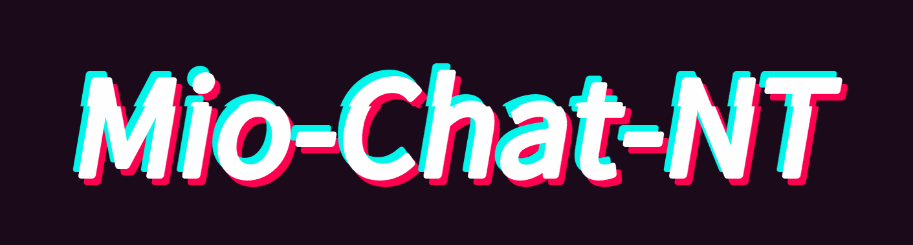
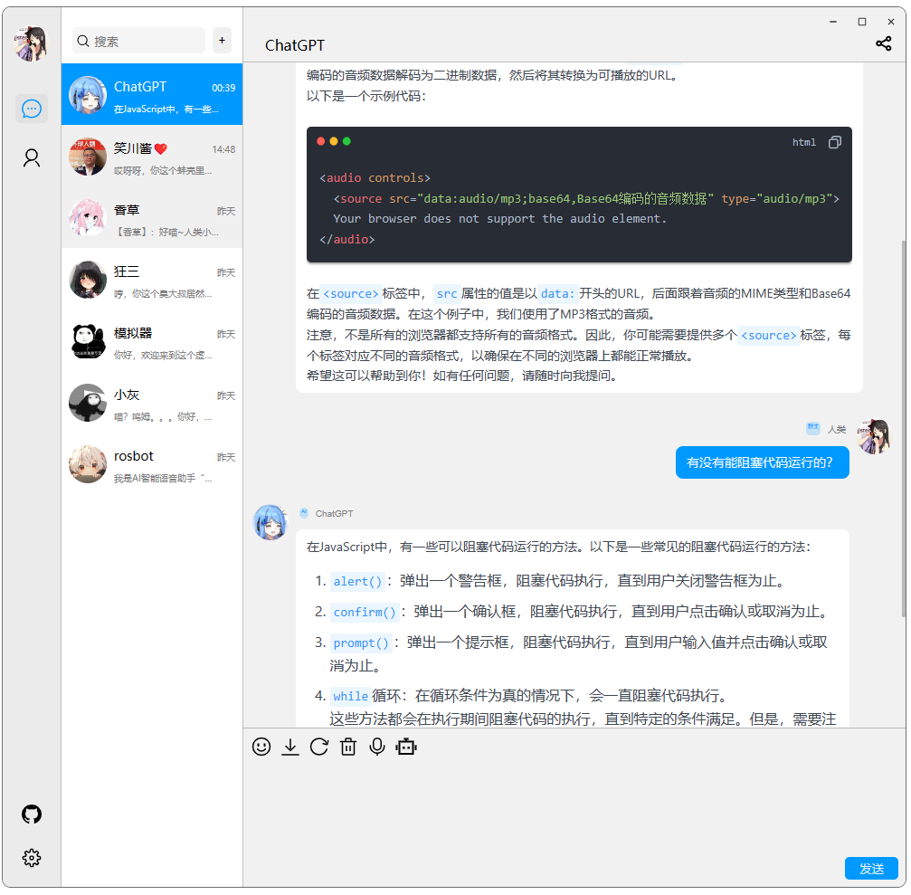
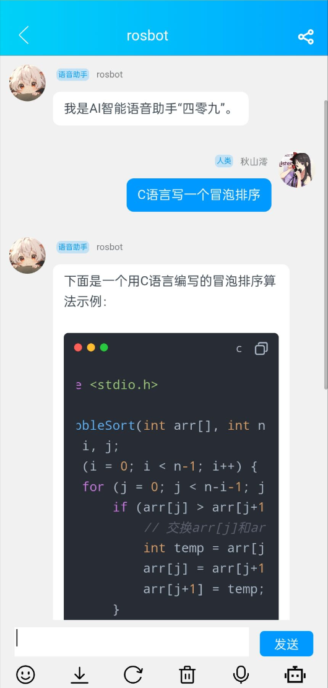

|                      |                    | 
|------------------------------|------------------------------|
|  |  |

## 通知
由于后端项目更新进度缓慢，本项目停止更新，启动对接 onebot协议的新项目 [mio-chat](https://github.com/Pretend-to/mio-chat-backend)

## 简介
仿 qqnt 的 gpt webUI，由 [@lss233](https://github.com/lss233) 的优秀开源项目 [chatgpt-mirai-qq-bot](https://github.com/lss233/chatgpt-mirai-qq-bot) 提供后端支持。

## features
- markdown 支持
- 对话
- 音频/图像支持
- 移动端支持 (优化中) 
- 访问/管理码
- 聊天记录以图像分享

## TODO
- 接入 OpenAI接口
- ~~小程序~~ (没打算过审)
- UI 美化
- 基于前端的联系人与 prompt 管理
- 流式响应
- 重构💩山代码

## TOTODO
- **接入 ONEBot**

## 配置

项目正快速迭代中，方式随时变化，所以不提供说明。

## 鸣谢
- 本项目直接或间接使用的优秀的开源项目：
  -  [vue](https://vuejs.org/)
  - [chatgpt-mirai-qq-bot
](https://github.com/lss233/chatgpt-mirai-qq-bot) 
  - [md-editor-v3](https://github.com/imzbf/md-editor-v3)
  - [emoji-picker-element](https://www.npmjs.com/package/emoji-picker-element)
- 给我 star 的你 ❤️

## 找到我&&学习交流
- 企鹅群 : 798543340 
